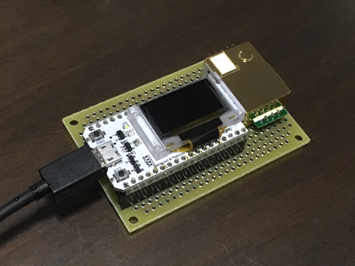

# arduino_esp32_when_to_ventilate

- This is a project for ESP32 with SSD1306 OLED modules.
- MH-Z19B is required to build this hardware. (get it from ebay or amazon approximately US$20.)
- MH-Z19B can be connected to microcontroller in two way. PWM or Serial. I chose Serial.

## installation instruction
- Add esp32 tool chain to your Arduino IDE.
  [github.com/espressif/arduino-esp32](https://github.com/espressif/arduino-esp32)

- Add "Adafruit-GFX-Library" to your libraries folder.
[github.com/adafruit/Adafruit-GFX-Library](https://github.com/adafruit/Adafruit-GFX-Library)

- Add "Adafruit_SSD1306" to your libraries folder.
[github.com/adafruit/Adafruit_SSD1306](https://github.com/adafruit/Adafruit_SSD1306)

- Due to the nature of Adafruit library, you need to change the value of "SSD1306_LCDHEIGHT" to 64 so that it fits the actual display dimensions.

## Notes
- The ESP32 board has a cheap/low-quality Chinese chip(CH341). This chip cannot go beyond 115200bps.
- IO pins for Serial1 is already been used. Serial2 is the only available option to communicate with MH-19B for this board.
